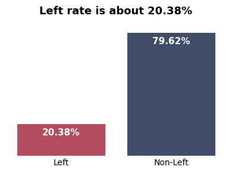
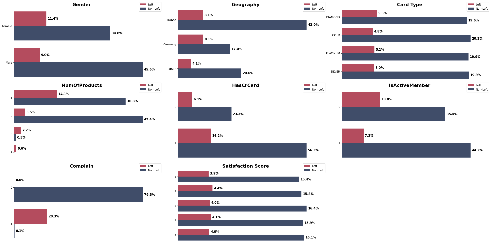
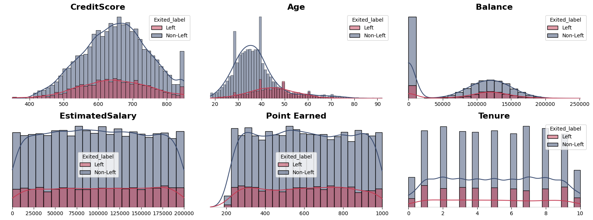
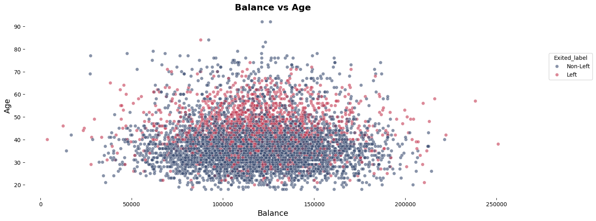
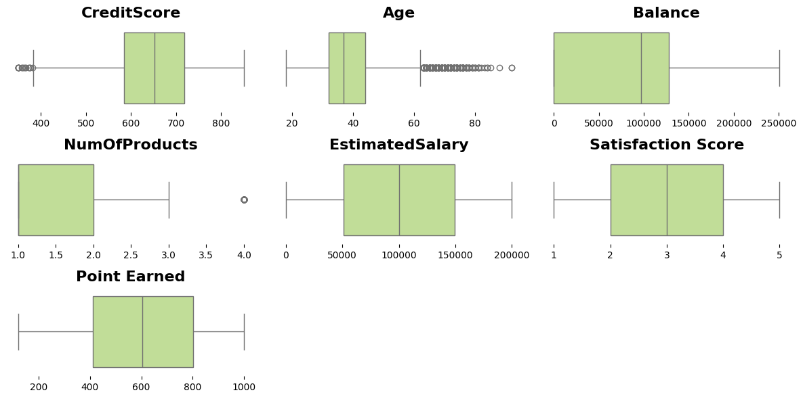
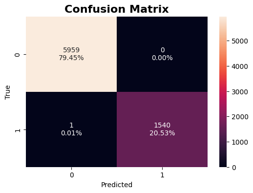
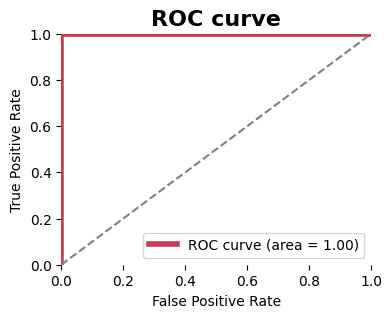
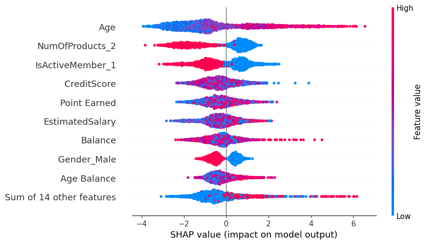
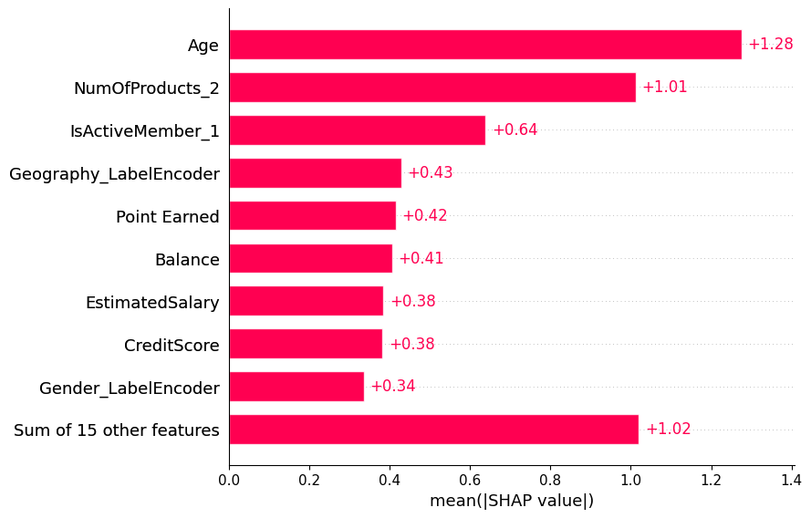

# Bank Customer Churn

## Introduction

The acquisition of new customers is always associated with a significant financial investment on the part of the company. Therefore, it is essential to avoid losing any customers and to identify the motivations behind their departure. In this project, an analysis of the data from a bank located in Europe was conducted to identify these motivations. Additionally, a machine learning classification model was used to predict which customers are most likely to leave the bank.

## Objective

The objective of this project is to analyze and develop the training of a machine learning model to identify which customers have a higher tendency to churn. A comparison was also made between different classification methods (catboost, lightgbm, and xgboost) using the following validation metrics: Accuracy, Precision, Recall, F1 Score, ROC AUC, Matthews Correlation Coefficient, Cohen Kappa, and Log Loss.

### Repository Layout

The file **__main.ipynb__** presents all the code and other analyses performed on the data. In the **__assets/img__** folder, you can find all the images used in this document. In the **__data/__** folder, you will find the zip file with the original data and the six CSV files representing the turbines. The **__requirements.txt__** file is where all the libraries used in this project are listed

## [Data Set](https://www.kaggle.com/datasets/radheshyamkollipara/bank-customer-churn)

The dataset was obtained from Kaggle, where a variety of information about it is available, including descriptions of the meaning of each column and the types of data we might encounter, such as categorical, numerical, and so on. This information can be found in the **main.ipynb** file, right at the beginning of the document. I will not include this information here in the README.md to avoid cluttering the content.

## Methodology and Results

After conducting an initial analysis to identify possible duplicate rows, incorrect variable types in the DataFrame, and missing rows, it was possible to determine the proportion of customers who chose to leave. The figure below illustrates this percentage, revealing that **20.38%** of customers opted to leave the bank, pertaining to the period during which the database was developed.

Below is another bar chart analyzing each item in relation to customers who left the bank (red) or stayed (blue). The values analyzed include: Gender, Geography, Card Type, NumOfProducts, HasCrCard, IsActiveMember, Complain, and Satisfaction Score. It is possible to observe that most of this data does not have a significant impact on the number of customers who left the service. In the case of Complaints, we have a different analysis: all individuals who made a complaint left the bank, and only 0.**1%** of the customers who complained remained with the institution. For the purposes of model training, this item was not used, as the goal of this work is to develop training with various classification models. On the other hand, from a business model perspective, this is quite concerning. It is highly likely that this company has a customer support team facing serious issues, and measures should be taken to avoid such situations.

This entire work uses the same color code described in the paragraph above. In the chart below, it is possible to observe six histograms of the following topics: CreditScore, Age, Balance, Estimated Salary, Points Earned, and Tenure. The only one that shows a different average value among customers who left the company is Age.

Below is a scatter plot showing the relationship between balance and age. There is a predominance of customers who left the company in the age range of 50 to 65 years, regardless of their account balance.

A boxplot was also created using the following data: CreditScore, Age, Balance, NumOfProducts, EstimatedSalary, Satisfaction Score, and Points Earned. This plot was used to identify potential outliers and assess if any of these values were more prevalent among customers who left or remained with the bank. For this project, this was an initial exploratory analysis, with no actions taken regarding the outliers found.

Before starting the tests with the three classification models, several modifications and additions were made to the data. As part of feature engineering, a new column was created with grouped age ranges as follows: '0-24' < '25-34' < '35-44' < '45-54' < '55-64' < '65+'. The reason for this was to help the models more easily identify which age groups have a higher likelihood of leaving the bank. Another column was also created to categorize each customer's balance as 'Negative' < 'Low' < 'Medium' < 'High', once again making it easier for the model to identify customers with higher or lower balance values. Both of these variables were encoded using the OrdinalEncoder, along with the card type.

By analyzing the data, a possible trend was identified between age, balance, and the likelihood of customers leaving the bank. For this reason, these two variables were passed through PolynomialFeatures, generating a second-degree polynomial and creating three new columns: Age^2, Age*Balance, and Balance^2.

Additionally, the StandardScaler was applied to the following columns: 'CreditScore', 'Balance', 'EstimatedSalary', and 'Point Earned'. Finally, the OneHotEncoder was used for the columns: 'Gender', 'NumOfProducts', 'HasCrCard', 'IsActiveMember', 'Satisfaction Score', and 'Geography'.

At the end of this process, I obtained a DataFrame with the following columns: 'AgeGroup', 'BalanceCategory', 'Age', 'Balance', 'Age^2', 'Age Balance', 'Balance^2', 'CreditScore','EstimatedSalary', 'Point Earned', 'Card_Type_OrdinalEncoder', 'BalanceCategory_Encoded', 'AgeGroup_Encoded', 'Gender_Male', 'NumOfProducts_2', 'NumOfProducts_3', 'NumOfProducts_4', 'HasCrCard_1', 'IsActiveMember_1', 'Satisfaction Score_2', 'Satisfaction Score_3', 'Satisfaction Score_4', 'Satisfaction Score_5', 'Geography_Germany', 'Geography_Spain'.

With the DataFrame data prepared, the classification models CatBoost, LightGBM, and XGBoost were applied. For each model, a simplified optimization of their hyperparameters was performed, as more detailed adjustments or deeper searches resulted in overfitting and worsened the validation parameters. The table below presents the results of this analysis, where each model was tested using the data split into training and testing sets with the train_test_split function, as well as cross-validation using the KFold function.

As can be seen, all three models demonstrated excellent performance, coming close to accurately predicting all outcomes, making cross-validation unnecessary. However, since this dataset lacks much information about its origin, it is possible that it contains some bias, as real-world problems rarely allow for this level of precision to be achieved so easily. Continuing with the analysis, the XGBoost model achieved the best results across both common metrics such as Accuracy, Precision, Recall, F1 Score, and ROC AUC, as well as less commonly used metrics like Matthews Corrcoef, Cohen Kappa, and Log Loss. In particular, Matthews Corrcoef and Cohen Kappa reached their maximum values, while Log Loss was extremely close to 0.

| Model        | Accuracy | Precision | Recall | F1 Score | ROC AUC | Matthews Corrcoef | Cohen Kappa | Log Loss |
|:-------------|:--------:|:---------:|:------:|:--------:|:-------:|:-----------------:|:-----------:|:--------:|
| normal_xgb   |  99.99   |   99.99   |  99.99 |  99.99   |  100.00 |        1.00       |     1.00    |  3.89    |
| normal_lgb   |  99.33   |   99.34   |  99.33 |  99.33   |  99.98  |        0.98       |     0.98    |  9.60    |
| normal_cb    |  98.01   |   98.05   |  98.01 |  97.98   |  99.77  |        0.94       |     0.94    |  10.20   |
| cross_cb     |  85.98   |   85.07   |  85.98 |  84.98   |  85.43  |        0.53       |     0.51    |  35.72   |
| cross_lgb    |  85.72   |   84.69   |  85.72 |  84.64   |  85.42  |        0.51       |     0.50    |  36.07   |
| cross_xgb    |  85.45   |   84.51   |  85.45 |  84.53   |  83.76  |        0.51       |     0.50    |  42.26   |

To demonstrate how close to perfection the results of this model were, below are the confusion matrix and the ROC curve, both tested with the test data. It is evident that this model is well-trained, achieving an almost perfect performance. Below these two items, we can also observe a table with the validation results of the system, showing the best possible values.

| Accuracy | Precision | Recall | F1 Score | ROC AUC | Matthews Corrcoef | Cohen Kappa | Log Loss |
|:--------:|:---------:|:------:|:--------:|:-------:|:-----------------:|:-----------:|:--------:|
|  100.0   |   100.0   |  100.0 |   100.0  |  100.0  |        1.0        |     1.0     |  1.08    |

To extract more information from this analysis, the SHAP library was used to identify which features had the greatest impact on the model's predictions. As noted earlier, age had a significant impact on customer classification, with older individuals showing greater differentiation. Another factor that had not been highlighted was the presence of customers who have product number 2. Since this table is binary and there is a large predominance of people who have this product and have not churned, this information becomes relevant.

## Conclusion

This work aimed to implement an analysis on the database of a European bank, with the purpose of training a machine learning model to predict which customers will leave the institution and to identify the possible factors contributing to this decision. Early in the project, a glaring issue was identified: all customers who made complaints ended up leaving the company. From the perspective of this study, this column presented a significant bias, as it made it easy to identify customers who were likely to churn. Therefore, this data was excluded from the analysis. Additionally, it is recommended that the company invest in a more in-depth analysis across all departments related to problem resolution to investigate what those problems might be.

After processing the data, a DataFrame was created with the information described in the methodology, and six tests were conducted. The results obtained are nearly perfect, in contrast to the issues often encountered in the real world. It is possible that the creator of this dataset introduced some bias, resulting in models with performance so close to perfection. With these caveats in mind, XGBoost showed the best results across all evaluated parameters. At the end of this project, it was also possible to identify which features were most relevant for classification.