# Bank Customer Churn

## Introduction

The acquisition of new customers is always associated with a significant financial investment on the part of the company. Therefore, it is essential to avoid losing any customers and to identify the motivations behind their departure. In this project, an analysis of the data from a bank located in Europe was conducted to identify these motivations. Additionally, a machine learning classification model was used to predict which customers are most likely to leave the bank.

## Objective

The objective of this project is to analyze and develop the training of a machine learning model to identify which customers have a higher tendency to churn. A comparison was also made between different classification methods (catboost, lightgbm, and xgboost) using the following validation metrics: Accuracy, Precision, Recall, F1 Score, ROC AUC, Matthews Correlation Coefficient, Cohen Kappa, and Log Loss.

### Repository Layout

The file **__main.ipynb__** presents all the code and other analyses performed on the data. In the **__assets/img__** folder, you can find all the images used in this document. In the **__data/__** folder, you will find the zip file with the original data and the six CSV files representing the turbines. The **__requirements.txt__** file is where all the libraries used in this project are listed

## [Data Set](https://www.kaggle.com/datasets/radheshyamkollipara/bank-customer-churn)

The dataset was obtained from Kaggle, where a variety of information about it is available, including descriptions of the meaning of each column and the types of data we might encounter, such as categorical, numerical, and so on. This information can be found in the **main.ipynb** file, right at the beginning of the document. I will not include this information here in the README.md to avoid cluttering the content.

## Methodology and Results

After conducting an initial analysis to identify possible duplicate rows, incorrect variable types in the DataFrame, and missing rows, it was possible to determine the proportion of customers who chose to leave. The figure below illustrates this percentage, revealing that **20.38%** of customers opted to leave the bank, pertaining to the period during which the database was developed.

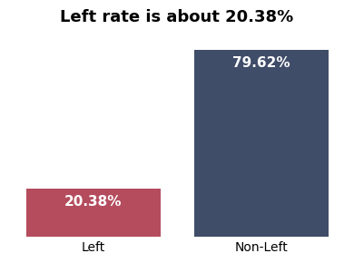

Below is another bar chart analyzing each item in relation to customers who left the bank (red) or stayed (blue). The values analyzed include: Gender, Geography, Card Type, NumOfProducts, HasCrCard, IsActiveMember, Complain, and Satisfaction Score. It is possible to observe that most of this data does not have a significant impact on the number of customers who left the service. In the case of Complaints, we have a different analysis: all individuals who made a complaint left the bank, and only 0.**1%** of the customers who complained remained with the institution. For the purposes of model training, this item was not used, as the goal of this work is to develop training with various classification models. On the other hand, from a business model perspective, this is quite concerning. It is highly likely that this company has a customer support team facing serious issues, and measures should be taken to avoid such situations.

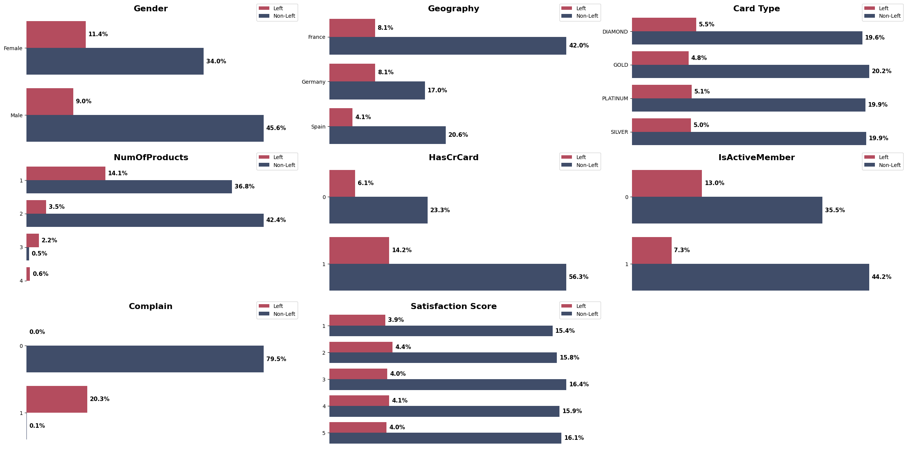

This entire work uses the same color code described in the paragraph above. In the chart below, it is possible to observe six histograms of the following topics: CreditScore, Age, Balance, Estimated Salary, Points Earned, and Tenure. The only one that shows a different average value among customers who left the company is Age.

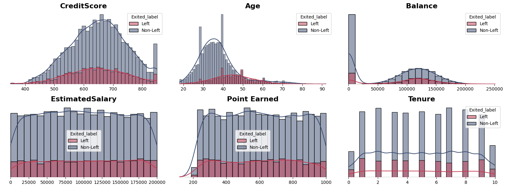

Below is a scatter plot showing the relationship between balance and age. There is a predominance of customers who left the company in the age range of 50 to 65 years, regardless of their account balance.

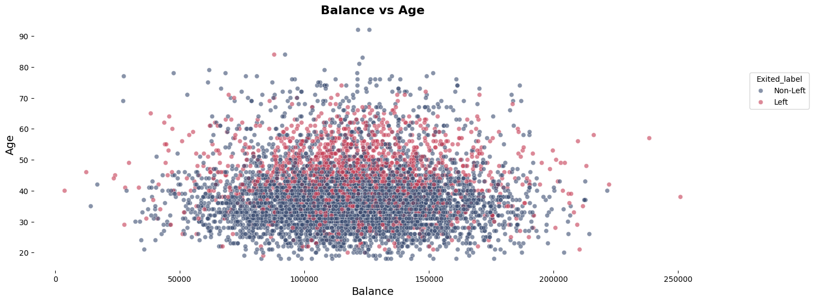

A boxplot was also created using the following data: CreditScore, Age, Balance, NumOfProducts, EstimatedSalary, Satisfaction Score, and Points Earned. This plot was used to identify potential outliers and assess if any of these values were more prevalent among customers who left or remained with the bank. For this project, this was an initial exploratory analysis, with no actions taken regarding the outliers found.

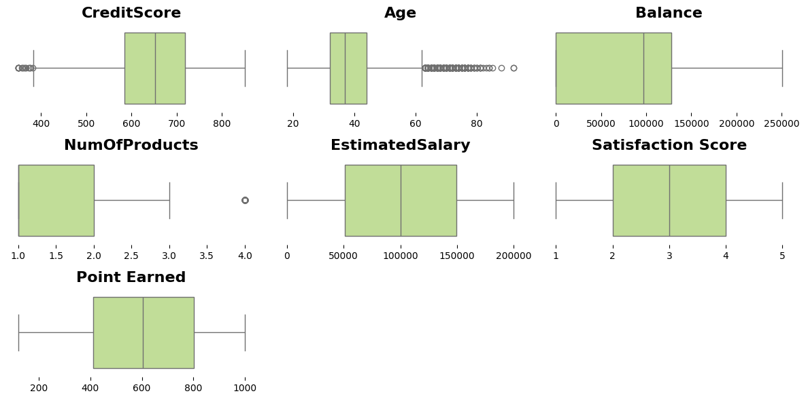

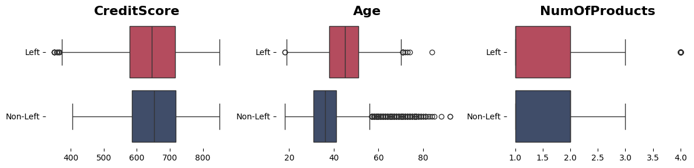

Before starting the tests with the three classification models, several modifications and additions were made to the data. As part of feature engineering, a new column was created with grouped age ranges as follows: '0-24' < '25-34' < '35-44' < '45-54' < '55-64' < '65+'. The reason for this was to help the models more easily identify which age groups have a higher likelihood of leaving the bank. Another column was also created to categorize each customer's balance as 'Negative' < 'Low' < 'Medium' < 'High', once again making it easier for the model to identify customers with higher or lower balance values. Both of these variables were encoded using the OrdinalEncoder, along with the card type.

By analyzing the data, a possible trend was identified between age, balance, and the likelihood of customers leaving the bank. For this reason, these two variables were passed through PolynomialFeatures, generating a second-degree polynomial and creating three new columns: Age^2, Age*Balance, and Balance^2.

Additionally, the StandardScaler was applied to the following columns: 'CreditScore', 'Balance', 'EstimatedSalary', and 'Point Earned'. Finally, the OneHotEncoder was used for the columns: 'Gender', 'NumOfProducts', 'HasCrCard', 'IsActiveMember', 'Satisfaction Score', and 'Geography'.

At the end of this process, I obtained a DataFrame with the following columns: 'Age_poly', 'Balance_poly', 'Age^2_poly', 'Age Balance_poly', 'Balance^2_poly', 'CreditScore_StandardScaler', 'Balance_StandardScaler', 'EstimatedSalary_StandardScaler', 'Point Earned_StandardScaler', 'Card_Type_OrdinalEncoder', 'BalanceCategory_Encoded', 'AgeGroup_Encoded', 'Gender_Male','NumOfProducts_2', 'NumOfProducts_3', 'NumOfProducts_4', 'HasCrCard_1', 'IsActiveMember_1', 'Satisfaction Score_2', 'Satisfaction Score_3', 'Satisfaction Score_4', 'Satisfaction Score_5', 'Geography_Germany', 'Geography_Spain'.

With the definition of the columns to be used and the proper data preprocessing, it became feasible to analyze the correlation among the dataset variables. The figure below illustrates this correlation, implemented using the Pearson correlation coefficient, and visualized through a heatmap. When examining the row corresponding to the target variable Exited, it is noticeable that some variables exhibit a positive correlation (such as Age^2) while others show a negative correlation, such as AgeGroup_Encoded. These variables demonstrate potential relevance in identifying patterns associated with customer churn, indicating that they may have a significant impact on the performance of machine learning models for churn prediction.

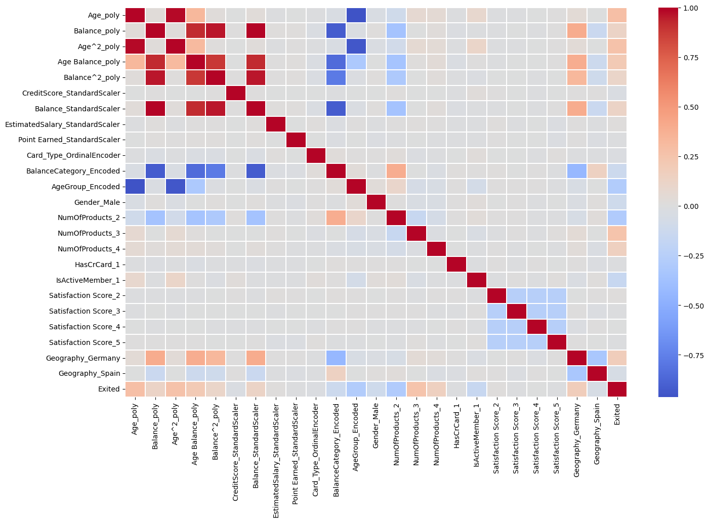

With the DataFrame data prepared, the classification models CatBoost, LightGBM, and XGBoost were applied. For each model, a simplified optimization of their hyperparameters was performed, as more detailed adjustments or deeper searches resulted in overfitting and worsened the validation parameters. The table below presents the results of the analysis, where each model was evaluated using data splitting into training and test sets with the train_test_split function, as well as cross-validation with the KFold function. The table is sorted in descending order based on the Log Loss metric.

| Model        | Accuracy | Precision | Recall | F1 Score | ROC AUC | Matthews Corrcoef  | Cohen Kappa | Log Loss |
|:-------------|:--------:|:---------:|:------:|:--------:|:-------:|:------------------:|:-----------:|:--------:|
| cross_xgb    |  86.57   |   85.75   |  86.57 |  85.43   |  86.81  |        0.54        |     0.53    |  33.21   |
| cross_cb     |  86.59   |   85.78   |  86.59 |  85.44   |  86.95  |        0.54        |     0.53    |  32.95   |
| cross_lgb    |  86.12   |   85.17   |  86.12 |  84.98   |  85.91  |        0.53        |     0.51    |  34.31   |

None of the evaluated models demonstrated clear superiority across all aspects. However, when considering the metric values exclusively, the CatBoost model stands out as the most logical choice, mainly due to its superior performance in ROC AUC and Log Loss.

Despite this, CatBoost's execution time was approximately five times longer than that of XGBoost, representing a significant drawback in production scenarios. Considering that the XGBoost model achieved very similar performance metrics to those of CatBoost but with greater computational efficiency, it was selected as the final model for deployment. This decision aims to ensure a balance between predictive performance and operational feasibility in production environments.

With the selected model, the simulation was carried out using the test dataset. Below, the confusion matrix and the ROC curve are presented, along with a table containing the system's validation metric results.

The results indicate that applying this method to the proposed problem yields consistent performance, with standout metrics such as Accuracy, Precision, Recall, F1 Score, and ROC AUC, all with values close to 90%. The ROC curve also highlights the model’s strong discriminative capability.

Additionally, the Matthews Correlation Coefficient (MCC) and Cohen’s Kappa metrics presented values above 0.6, reinforcing the robustness of the model in evaluating both balanced and imbalanced classifications. Finally, the Log Loss metric showed a very low value, indicating high confidence in the model’s predictions.

| Accuracy | Precision | Recall | F1 Score | ROC AUC | Matthews Corrcoef | Cohen Kappa | Log Loss |
|:--------:|:---------:|:------:|:--------:|:-------:|:-----------------:|:-----------:|:--------:|
|  90.43   |   90.16   |  90.43 |   89.75  |  93.63  |       0.67        |     0.66    |  24.91   |

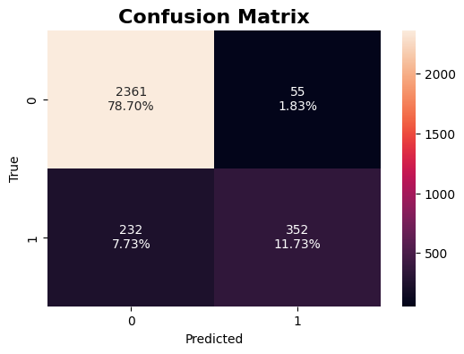

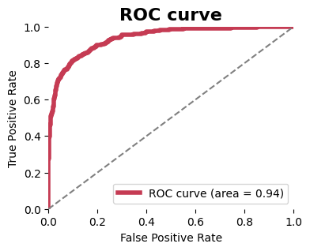

To deepen the analysis and interpret the model results, the SHAP (SHapley Additive exPlanations) library was used to identify the variables with the greatest impact on the predictions. As previously highlighted, the variable age showed significant influence in customer classification, especially among individuals in older age groups, who exhibited a greater distinction regarding churn.

Additionally, the SHAP analysis revealed an extra factor that had not been previously emphasized: the presence of customers with a number of products equal to 2. Since this variable is represented in binary form, and there is a considerable predominance of customers with this value who did not leave the bank, this attribute becomes significantly relevant in explaining the model’s predictive behavior.

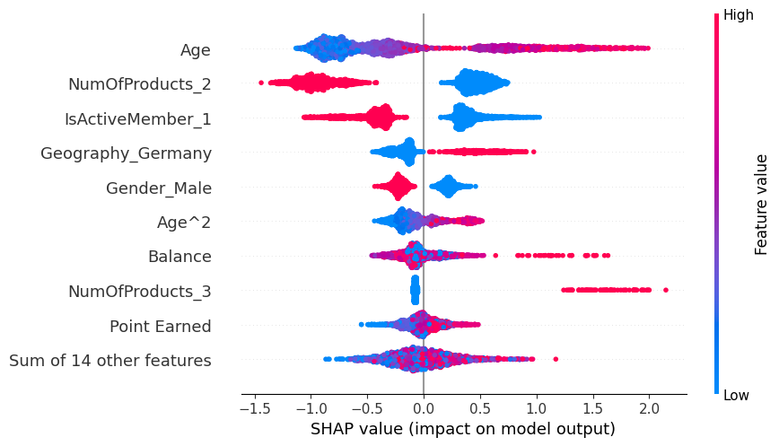

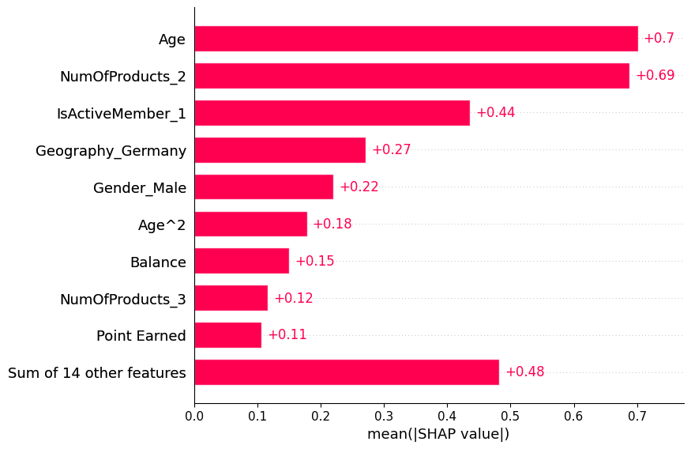

## Conclusion

This study aimed to analyze the dataset of a European banking institution with the purpose of training a machine learning model capable of predicting which customers are likely to leave the company (churn) and identifying the possible factors that contribute to this decision.

Early in the project, a critical issue was identified: all customers who had submitted complaints ended up terminating their relationship with the bank. From an analytical standpoint, this variable introduced a significant bias, disproportionately simplifying the identification of customers prone to churn. For this reason, this column was excluded from the analysis. Furthermore, it is recommended that the institution conduct a deeper investigation within the departments responsible for customer service and issue resolution to better understand the underlying causes of these complaints.

After data preprocessing, a DataFrame was created as described in the methodology, and six validation experiments were conducted. The results obtained showed exceptionally high metrics, which contrasts with the challenges commonly observed in real-world scenarios. This raises the hypothesis that the dataset creator may have introduced some form of bias, resulting in models with near-perfect performance.

Given this context, the XGBoost model was selected for the production phase, as it achieved evaluation metrics very close to the best-performing model (CatBoost), but with a significantly lower execution time, making it more suitable for deployment in production environments. At the end of the project, interpretability techniques also made it possible to identify the variables with the greatest impact on customer classification.