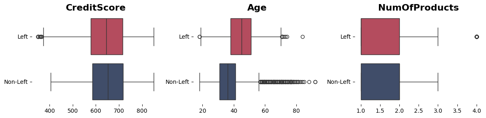
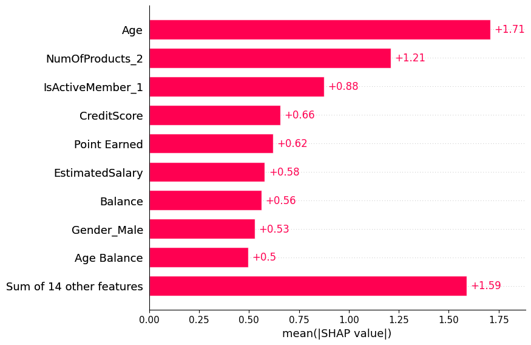

# Bank Customer Churn

## Introduction

The acquisition of new customers is always associated with a significant financial investment on the part of the company. Therefore, it is essential to avoid losing any customers and to identify the motivations behind their departure. In this project, an analysis of the data from a bank located in Europe was conducted to identify these motivations. Additionally, a machine learning classification model was used to predict which customers are most likely to leave the bank.

## Objective

The objective of this project is to analyze and develop the training of a machine learning model to identify which customers have a higher tendency to churn. A comparison was also made between different classification methods (catboost, lightgbm, and xgboost) using the following validation metrics: Accuracy, Precision, Recall, F1 Score, ROC AUC, Matthews Correlation Coefficient, Cohen Kappa, and Log Loss.

### Repository Layout

The file __main.ipynb__ presents all the code and other analyses performed on the data. In the __assets/img__ folder, you can find all the images used in this document. In the __data/__ folder, you will find the zip file with the original data and the six CSV files representing the turbines. The __requirements.txt__ file is where all the libraries used in this project are listed

## [Data Set](https://www.kaggle.com/datasets/radheshyamkollipara/bank-customer-churn)

The dataset was obtained from Kaggle, where a variety of information about it is available, including descriptions of the meaning of each column and the types of data we might encounter, such as categorical, numerical, and so on. This information can be found in the __main.ipynb__ file, right at the beginning of the document. I will not include this information here in the README.md to avoid cluttering the content.

## Methodology and Results

After conducting an initial analysis to identify possible duplicate rows, incorrect variable types in the DataFrame, and missing rows, it was possible to determine the proportion of customers who chose to leave. The figure below illustrates this percentage, revealing that 20.38% of customers opted to leave the bank, pertaining to the period during which the database was developed.

    

Gender, Geography, Card Type, NumOfProducts, HasCrCard, IsActiveMember, Complain, Satisfaction Score

CreditScore, Age, Balance, EstimatedSalary, Point Earned, Tenure

Balance, Age

CreditScore, Age, Balance, NumOfProducts, EstimatedSalary, Satisfaction Score, Point Earned

| Model         | Accuracy | Precision | Recall | F1 Score | ROC AUC | Matthews Corrcoef | Cohen Kappa | Log Loss |
|---------------|----------|-----------|--------|----------|---------|-------------------|-------------|----------|
| normal_xgb    | 97.40    | 97.42     | 97.40  | 97.35    | 99.64   | 0.92              | 0.92        | 11.91    |
| normal_lgb    | 92.53    | 92.56     | 92.53  | 92.10    | 97.67   | 0.76              | 0.75        | 20.03    |
| normal_cb     | 91.55    | 91.57     | 91.55  | 90.97    | 95.88   | 0.73              | 0.71        | 22.22    |
| cross_lgb     | 86.27    | 85.36     | 86.27  | 85.21    | 86.08   | 0.53              | 0.52        | 33.75    |
| cross_cb      | 86.27    | 85.36     | 86.27  | 85.27    | 86.10   | 0.53              | 0.52        | 33.99    |
| cross_xgb     | 85.39    | 84.32     | 85.39  | 84.43    | 84.51   | 0.51              | 0.50        | 36.88    |

    

    

## Conclusion